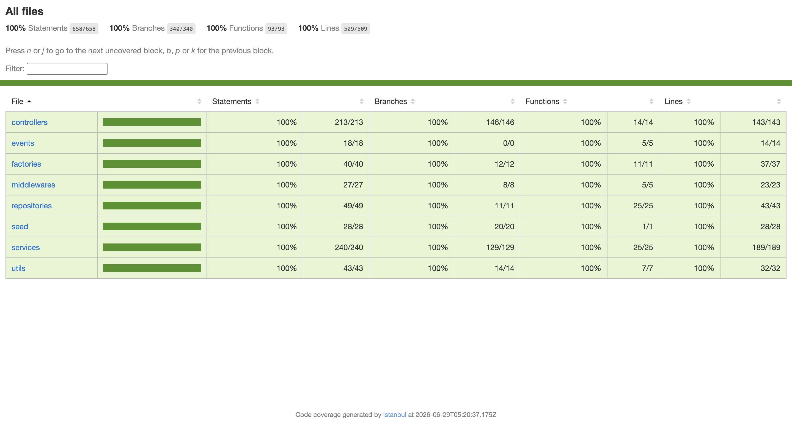

# MS-Users — Sanos y Salvos

Microservicio de **gestión de usuarios** de la plataforma **Sanos y Salvos**. Es la **fuente de verdad** de todos los datos del usuario: ciudadano e institución. Puede operar de forma **completamente independiente** — solo requiere PostgreSQL.

---

## Tecnologías

| Herramienta | Uso |
|---|---|
| Node.js 20 | Entorno de ejecución |
| Express 5 | Servidor HTTP |
| TypeScript 5 | Tipado estático |
| PostgreSQL 16 | Persistencia |
| TypeORM 0.3 | ORM y sincronización de esquema |
| Multer | Recepción de archivos en memoria |
| Cloudinary | Almacenamiento de fotos de perfil |
| Nodemailer | Envío de OTP por correo Gmail |
| jsonwebtoken | Verificación de Access Tokens JWT |
| bcrypt | Hash y verificación de contraseñas |
| Swagger / OpenAPI 3.0 | Documentación interactiva |
| Docker | Contenerización |

---

## Arquitectura

### Patrón arquitectónico

- **MVC (Model-View-Controller)**: Adaptado para APIs REST (Model-Route-Controller-Service). Los *Controllers* gestionan las solicitudes y respuestas HTTP, las *Routes* definen los endpoints, y la lógica de negocio se centraliza en los *Services*. Los *Models* representan las entidades de la base de datos.

### Patrón de diseño

- **Repository Pattern**: Utilizado a través de TypeORM para abstraer la capa de acceso a datos. Los servicios se comunican con los repositorios para realizar operaciones sobre la base de datos (CRUD) sin acoplarse directamente a sentencias SQL.

---

## Estructura del proyecto

```
ms-users/
├── src/
│   ├── config/
│   │   ├── cloudinary.ts           # Configuración Cloudinary (Singleton)
│   │   ├── db.ts                   # Conexión PostgreSQL + TypeORM (Singleton)
│   │   ├── redis.ts                # Definición de cola Bull (no utilizada en modo standalone)
│   │   └── swagger.ts              # Configuración OpenAPI 3.0
│   ├── controllers/
│   │   ├── user.controller.ts      # CRUD de usuarios
│   │   └── password.controller.ts  # Cambio y recuperación de contraseña
│   ├── events/
│   │   └── event-emitter.service.ts # Definición de eventos (no utilizada en modo standalone)
│   ├── factories/
│   │   └── UserFactory.ts          # Factory: ciudadanos e instituciones
│   ├── middlewares/
│   │   ├── errorHandler.ts
│   │   ├── notFound.ts
│   │   ├── requireRole.ts          # Control de acceso por rol
│   │   └── verifyToken.ts          # Verificación JWT
│   ├── models/
│   │   ├── Ciudadano.ts
│   │   ├── Institucion.ts
│   │   ├── PasswordResetOtp.ts     # OTP para reset
│   │   └── User.ts                 # Incluye password_hash (fuente de verdad)
│   ├── repositories/                # Capa independiente de acceso a datos (única que usa TypeORM)
│   │   ├── ciudadano.repository.ts
│   │   ├── institucion.repository.ts
│   │   ├── passwordResetOtp.repository.ts
│   │   └── user.repository.ts
│   ├── routes/
│   │   └── user.routes.ts          # Rutas + Swagger inline
│   ├── services/
│   │   ├── password.service.ts     # Cambio y reset de contraseña + OTP
│   │   └── user.service.ts         # CRUD de perfil y admin
│   ├── utils/
│   │   ├── mailer.ts               # Envío de OTP por Gmail (Singleton)
│   │   ├── response.ts             # Helpers HTTP estandarizados
│   │   ├── validarDigitoVerificador.ts  # Algoritmo módulo 11
│   │   └── validators.ts
│   ├── app.ts
│   └── server.ts                   # Entry point — crea BD si no existe
├── Dockerfile
├── docker-compose.yml
├── package.json
└── tsconfig.json
```

---

## Documentación interactiva

```
http://localhost:3002/api/docs
```

---

## Endpoints

### Registro público

| Método | Ruta | Descripción |
|---|---|---|
| `POST` | `/api/users/register/ciudadano` | Registro de persona natural con RUN |
| `POST` | `/api/users/register/institucion` | Registro de veterinaria o municipalidad con RUT |

### Recuperar contraseña (público)

| Método | Ruta | Descripción |
|---|---|---|
| `POST` | `/api/users/forgot-password` | Envía OTP de 6 dígitos al correo |
| `PATCH` | `/api/users/reset-password` | Verifica OTP y cambia la contraseña |

### Perfil (autenticado)

| Método | Ruta | Descripción |
|---|---|---|
| `GET` | `/api/users/perfil` | Ver perfil propio |
| `PATCH` | `/api/users/perfil` | Actualizar perfil (incluye foto) |
| `PATCH` | `/api/users/perfil/password` | Cambiar contraseña (requiere actual) |
| `DELETE` | `/api/users/perfil` | Desactivar cuenta (soft delete) |

### Administración (roles: administrador, superadmin, moderador)

| Método | Ruta | Roles | Descripción |
|---|---|---|---|
| `GET` | `/api/users/admin/usuarios` | admin, superadmin, moderador | Listar usuarios con filtros |
| `GET` | `/api/users/admin/usuarios/:id` | admin, superadmin, moderador | Ver usuario por ID |
| `PATCH` | `/api/users/admin/usuarios/:id/estado` | admin, superadmin | Activar/desactivar cuenta |
| `PATCH` | `/api/users/admin/usuarios/:id/rol` | admin, superadmin | Cambiar rol |
| `PATCH` | `/api/users/admin/usuarios/:id/datos` | admin, superadmin | Editar datos del usuario |

---

## Postman — Listo para probar

> **URL base:** `http://localhost:3002`

### Setup en Postman

Crea una **environment** con estas variables:

| Variable | Valor inicial |
|---|---|
| `baseUrl` | `http://localhost:3002` |
| `userId` | _(se completa cuando lo necesites)_ |

---

### 1. Registrar ciudadano

```http
POST {{baseUrl}}/api/users/register/ciudadano
Content-Type: application/json
```

```json
{
  "email": "fe.ruizr@duocuc.cl",
  "password": "123456q",
  "telefono": "912345678",
  "region": "08",
  "comuna": "Concepción",
  "primer_nombre": "Felipe",
  "segundo_nombre": "Andrés",
  "apellido_paterno": "Ruiz",
  "apellido_materno": "Rojas",
  "run": "11.111.111-1",
  "direccion": "Av. O'Higgins 123"
}
```

> Si quieres subir foto: usa **Body → form-data** (no raw JSON) con los mismos campos como `text` y agrega `foto_perfil` como `file`.

---

### 2. Registrar institución

```http
POST {{baseUrl}}/api/users/register/institucion
Content-Type: application/json
```

```json
{
  "email": "veterinaria@sanos.cl",
  "password": "123456q",
  "telefono": "912345678",
  "region": "08",
  "comuna": "Concepción",
  "nombre_institucion": "Veterinaria San Jorge",
  "razon_social": "San Jorge Ltda",
  "rut": "76.354.771-K",
  "tipo_institucion": "veterinaria",
  "direccion": "Av. Los Carrera 123"
}
```

---

### 7. Solicitar OTP para recuperar contraseña

```http
POST {{baseUrl}}/api/users/forgot-password
Content-Type: application/json
```

```json
{
  "email": "fe.ruizr@duocuc.cl"
}
```

> Si el correo existe, llega un código de 6 dígitos válido por **10 minutos**.

---

### 8. Reset password con OTP

```http
PATCH {{baseUrl}}/api/users/reset-password
Content-Type: application/json
```

```json
{
  "email": "fe.ruizr@duocuc.cl",
  "code": "123456",
  "newPassword": "nuevaPass123"
}
```

---

## Roles del sistema

| Rol | Descripción |
|---|---|
| `ciudadano` | Persona natural registrada |
| `veterinaria` | Institución veterinaria |
| `municipalidad` | Municipalidad |
| `moderador` | Solo lectura administrativa |
| `administrador` | Administración completa |
| `superadmin` | Acceso total |

---

## Modelo de datos

### Tabla `users` (fuente de verdad)

| Campo | Tipo | Descripción |
|---|---|---|
| `id` | UUID (PK) | Identificador único |
| `credential_id` | UUID único | Identificador externo del usuario (usado por ms-auth si está integrado) |
| `email` | string único | Correo del usuario |
| `password_hash` | string | Hash bcrypt — **fuente de verdad** |
| `telefono` | string | Teléfono |
| `foto_perfil` | string (URL) | URL de Cloudinary |
| `rol` | enum | Rol del usuario |
| `tipo` | enum | `ciudadano` / `institucion` |
| `region` | string | Código de región |
| `comuna` | string | Nombre de la comuna |
| `is_active` | boolean | Estado de la cuenta |
| `created_at` | timestamp | — |
| `updated_at` | timestamp | — |

### Tabla `ciudadanos`

| Campo | Tipo | Descripción |
|---|---|---|
| `id` | UUID (PK) | — |
| `user_id` | UUID (FK) | Referencia a `users` |
| `primer_nombre` | string | — |
| `segundo_nombre` | string (opcional) | — |
| `apellido_paterno` | string | — |
| `apellido_materno` | string (opcional) | — |
| `run` | string único | Formato `12345678-9` |
| `direccion` | string | — |

### Tabla `instituciones`

| Campo | Tipo | Descripción |
|---|---|---|
| `id` | UUID (PK) | — |
| `user_id` | UUID (FK) | Referencia a `users` |
| `nombre_institucion` | string | Nombre comercial |
| `razon_social` | string | Razón social legal |
| `rut` | string único | Formato `76354771-K` |
| `tipo_institucion` | enum | `veterinaria` / `municipalidad` |
| `direccion` | string | — |

### Tabla `password_reset_otps`

| Campo | Tipo | Descripción |
|---|---|---|
| `id` | UUID (PK) | — |
| `email` | string | Correo destinatario del OTP |
| `code` | string | Código de 6 dígitos |
| `expires_at` | timestamptz | TTL 10 minutos |
| `used` | boolean | Si ya fue consumido |
| `created_at` | timestamp | — |

---

## Validaciones

| Campo | Regla |
|---|---|
| `email` | Formato válido con dominio y extensión |
| `password` | Mínimo 6 caracteres |
| `telefono` | Solo números, `+` opcional al inicio |
| `primer_nombre`, `apellido_paterno` | Solo letras (incluye tildes y ñ), mínimo 3 caracteres |
| `nombre_institucion`, `razon_social` | Solo letras, mínimo 3 caracteres |
| `run` / `rut` | Validados con algoritmo módulo 11 chileno |

---

## Foto de perfil

- Se recibe como `multipart/form-data` en el campo `foto_perfil`
- Se sube a Cloudinary directamente desde memoria (sin escribir en disco)
- Al actualizar, la foto anterior se elimina automáticamente de Cloudinary
- Solo se persiste la URL (`secure_url`) en PostgreSQL

---

## Crear el primer superadmin (con Docker corriendo)

> Como no existe ningún admin todavía para usar el endpoint `/admin/usuarios/:id/rol`, hay que actualizar la BD manualmente. Solo requiere `ms-users` corriendo.

### Paso 1 — Registrar el usuario

```bash
curl -X POST http://localhost:3002/api/users/register/ciudadano \
  -H "Content-Type: application/json" \
  -d '{
    "email": "fe.ruizr@duocuc.cl",
    "password": "123456q",
    "telefono": "912345678",
    "region": "08",
    "comuna": "Concepción",
    "primer_nombre": "Felipe",
    "apellido_paterno": "Ruiz",
    "run": "11.111.111-1",
    "direccion": "Av. O'\''Higgins 123"
  }'
```

### Paso 2 — Promover a superadmin en la BD

```bash
docker exec ms-users-db psql -U postgres -d ms_users \
  -c "UPDATE users SET rol='superadmin' WHERE email='fe.ruizr@duocuc.cl';"
```

Debe responder `UPDATE 1`.

### Paso 3 — Verificar

Inicia sesión en `http://localhost` (o directamente en `ms-auth` si está disponible). Deberías ver opciones de administración.

> **A futuro:** una vez tengas un superadmin, los siguientes cambios de rol se hacen vía API (`PATCH /api/users/admin/usuarios/:id/rol`).

---

## Pruebas Unitarias

El proyecto cuenta con una suite de pruebas unitarias para garantizar la calidad y el correcto funcionamiento de los servicios.

**Ejecutar las pruebas:**
```bash
npm run test
```

**Generar reporte de cobertura:**
```bash
npm run test:coverage
```

Para visualizar el reporte de cobertura detallado, abre el archivo generado en tu navegador:
```bash
open coverage/index.html
```

**Reporte de cobertura test microservicio:**

